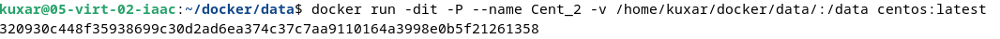
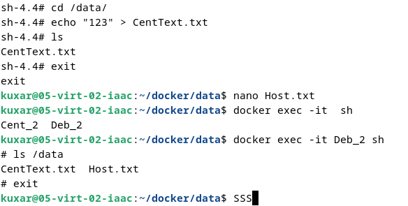
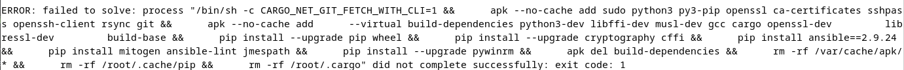

# 05-virt-03-docker
Домашнее задание к занятию 3. «Введение. Экосистема. Архитектура. Жизненный цикл Docker-контейнера»
#
    Задание 1
#
https://hub.docker.com/r/kuxar/05-virt-03-docker/
docker run -d -p 80:80 kuxar/05-virt-03-docker:3

Тело "index.html" можно было изменить в "Dockerfile"? 
"RUN echo 'текст' > /var/www/html/index.html"
#
    Задние 2
#
      1. Высоконагруженное монолитное Java веб-приложение

Физический сервер - мощности всех аппаратных мощностей необходимо направлять на указанный сервис.
   
      2. Nodejs веб-приложение
Данная платформа не требовательна к аппаратным ресурсам может быть развернута как в виде 
виртуальной машины так и контейнера

      3. Мобильное приложение c версиями для Android и iOS 

Контейнеры выгодно смотрятся из-за более быстрой развертки и тестирования.
    
      4. Шина данных на базе Apache Kafka 

Смотря сколько будет храниться информация в хранилище у "Kafka" можно разместить как на ВМ, так и на физ сервере. 
На физ сервер более предпочтительно.

      5.lasticsearch-кластер для реализации логирования продуктивного веб-приложения —  три нодыe lasticsearch, два 
      logstash и две ноды kibana

Можно устанавливать как на ВМ, так и в контейнеры. Контейнеры более предпочтительны из-за большей изоляции.

      6. Мониторинг-стек на базе Prometheus и Grafana
    
На ВМ так как преимущество докера в скорость развертки в указанном сценарии работы не является преимуществом.

      7. MongoDB как основное хранилище данных для Java-приложения
   
Физ сервер и ВМ подходят для выполнения задачи по хранению информации.

      8. Gitlab-сервер для реализации CI/CD-процессов и приватный (закрытый) Docker Registry

Можно устанавливать как на ВМ, так и в контейнеры. ВМ более предпочтительнее ьак как данный сервисы планируется
разворачивать на более долгосрочную преспективу.
#   
    Задание 3
#

#
    Задание 4
#
Не успеваю разобраться с ошибкой
